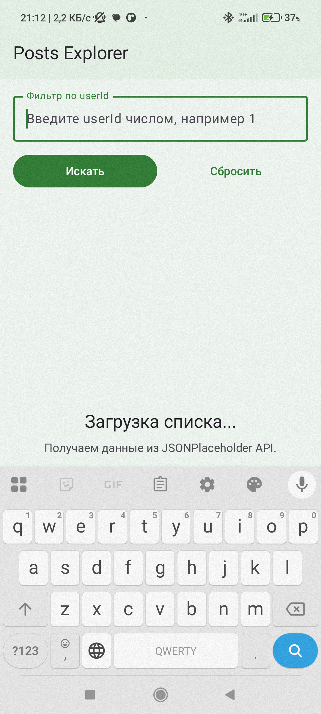
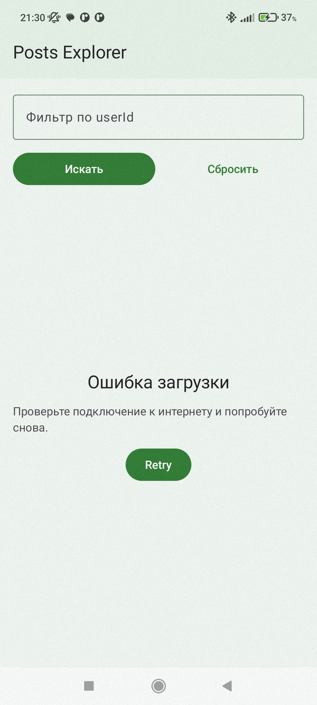
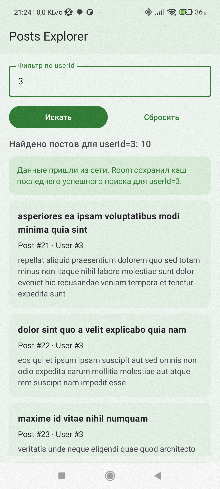
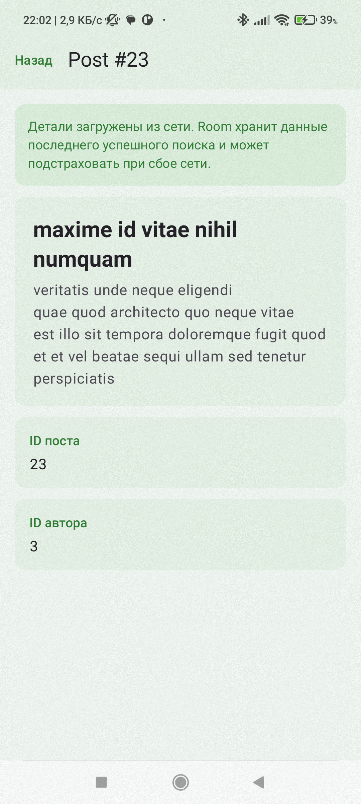
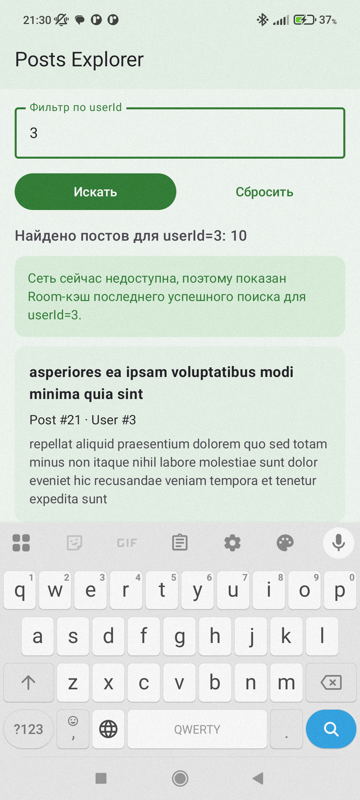

# Приложение "Posts Explorer"

## ФИО
Курышева Александра Александровна

## Группа
Б9124-09.03.03пикд(з)

## Тема приложения
Онлайн-приложение для просмотра постов из `JSONPlaceholder`.

## Какой API выбран
`JSONPlaceholder`  
<https://jsonplaceholder.typicode.com/posts>

API работает без ключа.

## Кратко суть
Приложение показывает список постов, позволяет фильтровать их по `userId` и открывать экран деталей выбранного поста.

Базой служит проект из ДЗ №3, а в рамках ДЗ №4 в него добавлены `Hilt` и `Room`.

## Что хранится в Room

Реализован сценарий: кэш последнего успешного поиска.

В `Room` сохраняются:
- `postId`
- `userId`
- `title`
- `body`
- служебный ключ кэша списка
- строка последнего успешного запроса (`userId` или пустой запрос для общего списка)
- время последнего обновления кэша

### Таблицы

- `cached_posts` — посты из последнего успешного поиска
- `search_cache_metadata` — метаданные последнего успешного поиска

### Как работает сценарий

- при успешной загрузке данные приходят из сети и сохраняются в `Room`
- в `Room` хранится только один актуальный кэш: результаты последнего успешного поиска
- после перезапуска приложение восстанавливает последний успешный запрос и пытается открыть именно его
- если сеть недоступна, приложение показывает сохранённый `Room`-кэш последнего успешного поиска
- экран деталей тоже может открыться офлайн, если пост входит в сохранённый кэш последнего успешного поиска
- в интерфейсе показывается, откуда пришли данные: из сети или из `Room`

## Скриншоты

### Loading

### Error

### List

### Detail

### Room Cache

